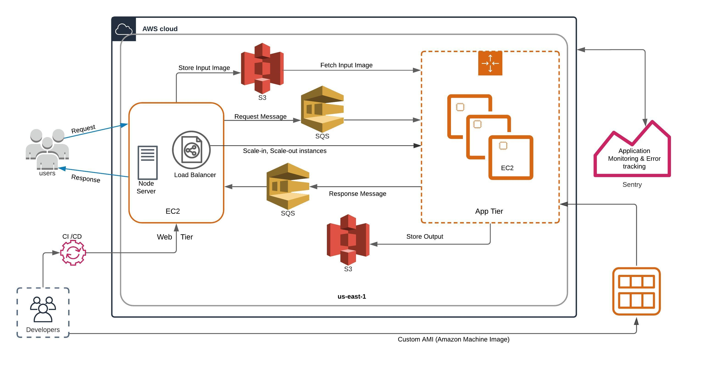

# Image-Recognition-as-a-Service-on-AWS
## Problem Statement 
This application employs a deep-learning model for image recognition. Users will send and receive multiple requests and responses for images from the application. Since the application deals with images and uses a deep-learning model, the processing can become time-consuming and the load on the application might increase as well. These problems can lead to a system crash and all the queued requests and responses will be lost. This system is not ideal for a good consumer experience and hence we are leveraging the advantages of Infrastructure as a Service(IaaS) to implement and deploy our service(image-recognition). 

Infrastructure as a service (IaaS) is a computing infrastructure, provisioned and managed over the internet. IaaS scales in and out in response to demand. IaaS is useful for handling unpredictable demand and steadily growing storage needs. It saves consumers money and time by allowing them to avoid purchasing and maintaining their own physical servers and data infrastructure. Each resource is available as a stand-alone service.

###          < This application is deployed using Amazon Web Services (AWS) >

## Architecture:

##### Elastic Compute Cloud: 
* In the AWS Cloud, Amazon Elastic Compute Cloud (Amazon EC2) offers scalable computing capacity. Using Amazon EC2 eliminates the need for upfront hardware investment, allowing customers to build and deploy applications more quickly. Amazon EC2 allows creating as many or as few virtual servers as needed and also enables customers to scale in or out to accommodate shifts in demand, reducing the need to forecast traffic.
* An instance is a virtual server in the cloud. Created 1 EC2 instance for the web tier and depending upon the load(requests), up to 19 App Tier EC2 instances will be created and terminated (scaled in and scaled out) automatically.
##### Simple Queue Service:
* Amazon Simple Queue Service(SQS) is a fully managed message queuing service for decoupling and scaling distributed systems. SQS eliminates the difficulty and overhead of maintaining and running message-oriented middleware. SQS is used to send, store, and receive messages.
* Used 2 Simple Queue Services in this application which is used to queue requests from the users and responses from the app tier. Used Standard queues as we need maximum throughput, and at-least-once delivery. We have also set the visibility timeout to 5 minutes.
##### Simple Storage Service: 
* Amazon Simple Storage Service(S3) is an object storage service that offers scalability, durability and performance.
* Used two S3 buckets, one to store images from the user requests in the web tier and another one to store responses from the deep-learning model from the app instances. All the inputs (images) and outputs (detection results) are stored in Simple Storage Service for persistence.
##### Amazon Machine Image: 
* The Amazon Machine Images (AMI) are like templates that are configured using an operating system, an application server, and any additional application required to deliver a service or a part of it. An AMI is a master image for the creation of EC2 instances in the Amazon Web Services (AWS) environment. 
* In this system, we created a custom AMI from an existing AMI that has an image recognition deep-learning model along with all the scripts needed to read requests, process images, save responses and terminate an instance. Depending upon the load, our load balancer will set up multiple instances (app-tier) from this machine image where the instances are of a similar configuration.

#### Load Balancer: 
The load balancer's primary responsibility is to continuously track the number of messages in the request queue and to scale-in and scale-out the creation of app instances automatically. Maximum instances, available instances, and required instances are the three main variables in a load balancer. The EC2 instances module provides a count of the current number of app instances running for each request. The total number of requests to be handled has also been received from the SQS request queue. We run our load balancer every second, and the load balancer creates app instances in our framework based on the visible messages in the SQS request queue and the values from the above three main variables. .In this way, we were able to incorporate a Load Balancer in our application to scale-in and scale-out creation of app instances automatically.

